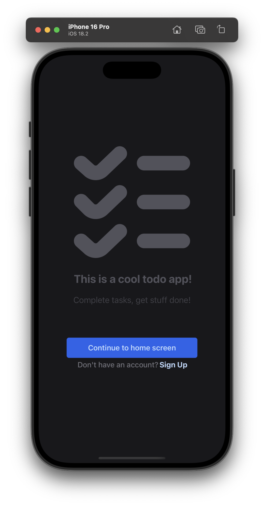

# Title: DivideNDo

The totally super generic todo app!



## Tech Stack:
 * Expo & React-Native
 * Supabase

## How to run

Make sure you have the following installed:
- [Expo CLI](https://docs.expo.dev/get-started/installation/)
- [Xcode](https://developer.apple.com/xcode/) (required for iOS builds)
- [Android Studio](https://developer.android.com/studio) (required for Android builds)
- [Node.js](https://nodejs.org/) (recommended version: LTS)

**1. Install dependencies:**
```sh
npm install
```

**2. Start the development server:**
```sh
npx expo start
```
This will open the Expo Dev Tools in your browser.

**3. Run the app:**
- **On iOS:** Press `i` in the Expo Dev Tools or terminal (requires Xcode).
- **On Android:** Press `a` in the Expo Dev Tools or terminal (requires Android Studio or an Android device).
- **On your device:** Scan the QR code in Expo Dev Tools using the Expo Go app.

**4. Building standalone apps:**
- **iOS:**
    ```sh
    npx expo run:ios

    # if you want to run with debug mode
    EXPO_DEBUG=true npx expo run:ios
    ```
- **Android:**
    ```sh
    npx expo run:android

     # if you want to run with debug mode
    EXPO_DEBUG=true npx expo run:android
    ```

For more details, see the [Expo documentation](https://docs.expo.dev/).

#### Author: Michael Elder